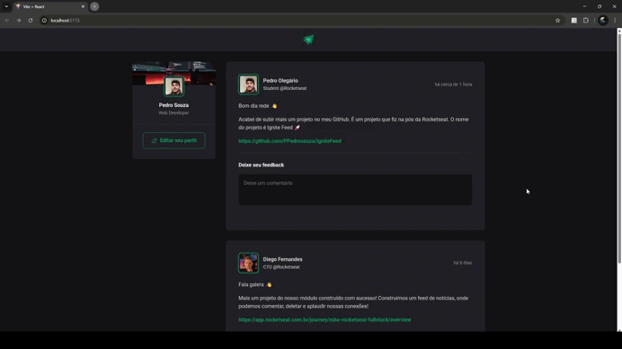

    Projeto de um feed de notícias chamado Ignite Feed desenvolvido durante as aulas sobre os motores React na Rocketseat.

  <a href="#-conceitos">Conceitos</a>&nbsp;&nbsp;&nbsp;|&nbsp;&nbsp;&nbsp;
  <a href="#-tecnologias">Tecnologias</a>&nbsp;&nbsp;&nbsp;|&nbsp;&nbsp;&nbsp;
  <a href="#-projeto">Projeto</a>&nbsp;&nbsp;&nbsp;|&nbsp;&nbsp;&nbsp;
  <a href="#memo-licença">Licença</a>

  

    

## 📖 Conceitos

- Programação imprerativa e programação declarativa
- Estado
- Closures no React
- Imutabilidade

## 🚀 Tecnologias

Esse projeto foi desenvolvido com as seguintes tecnologias:

- React
- Javascript
- CSS

